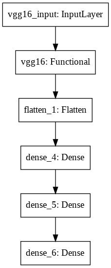
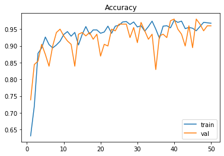

# Classic Rock-Paper-Scissors

## Intro:
This repo is for Semester VI. The project is a classic Rock-Paper-Scissors game. 
The custom built dataset consists of 3 classes : Rock, Paper, Scissors.

## Model:
Please get the **dataset and the model** <a href = "https://drive.google.com/drive/folders/1UKfwxUPQPuvKVmwNQjX9cjEMJ5L1j_Z7?usp=sharing">here</a>. (access restricted to Somaiya Account)

The dataset is generated using **captureImage.py** . Please press 'a' for starting the capturing of images.
The dataset(train + validation) is ~1000 images. The 'test_images' folder contains the test images 600 images(200 * 3).
After building and testing custom models, the accuracy was low. We currently use the concept of <a href = "https://thebinarynotes.com/transfer-learning-keras-vgg16/">tranfer learning</a> for our use case. We train the vgg16 model with 4 <a href = "https://keras.io/api/layers/core_layers/dense/">dense layers</a>, <a href = "https://developers.google.com/machine-learning/crash-course/regularization-for-simplicity/l2-regularization">l2 regularizers</a> to avoid <a href = "https://www.coursera.org/lecture/machine-learning/the-problem-of-overfitting-ACpTQ">overfitting</a> problem.

The library used for backend processing is <a href = "https://keras.io/getting_started/">Keras</a>.

This is a snap of plot_model:  

This gives us ~98% accuracy on live testing with web camera.
The model predicts the probability of each of the 3 classes. We display the class with max probability.

The plot of accuracy, loss, precision and recall are as follows:
.
## GUI:
For the Frontend we use vanilla js, HTML, CSS.  
For the Backend we use <a href = "https://flask.palletsprojects.com/en/1.1.x/">Flask</a> and communicate with the HTML templates using <a href="http://jinja.pocoo.org/docs"> Jinja</a> templating.
